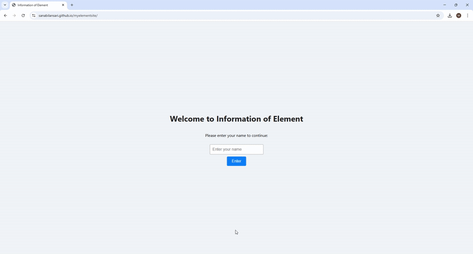

# myelementsite
An educational site for 9th–10th students
<h2 align="center">Hi there, I'm Sanabil Ansari 👋</h2>

<em>A self-taught coder from Mumbai, India 🇮🇳</em>

---

### 💡 About Me

- 🏫 **Education:** Completed 10th Grade  
- 💻 **Skills:** HTML, CSS, Python  
- 🎯 **Goal:** Make human work easier and faster through smart web solutions  
- 📬 **for collab/Email:** [ansarisanabil44@gmail.com](mailto:ansarisanabil44@gmail.com)  
- 🌐 **Live Website:** [sanabilansari.github.io/resisterform](https://sanabilansari.github.io/resisterform)  
- 💬 **Quote:** _"Knowledge is the key to success. Support and spread knowledge to all."_
-  🏫 **Company:** want to join any 

---
## 🔗 Live Demo

🚀 **[Click here to open the element site](https://sanabilansari.github.io/myelementsite/)** || 
📝 **[Click here to open the form website](https://sanabilansari.github.io/resisterform/)** ||

## 🎬 Website Demo

## Always preparing a new plan

